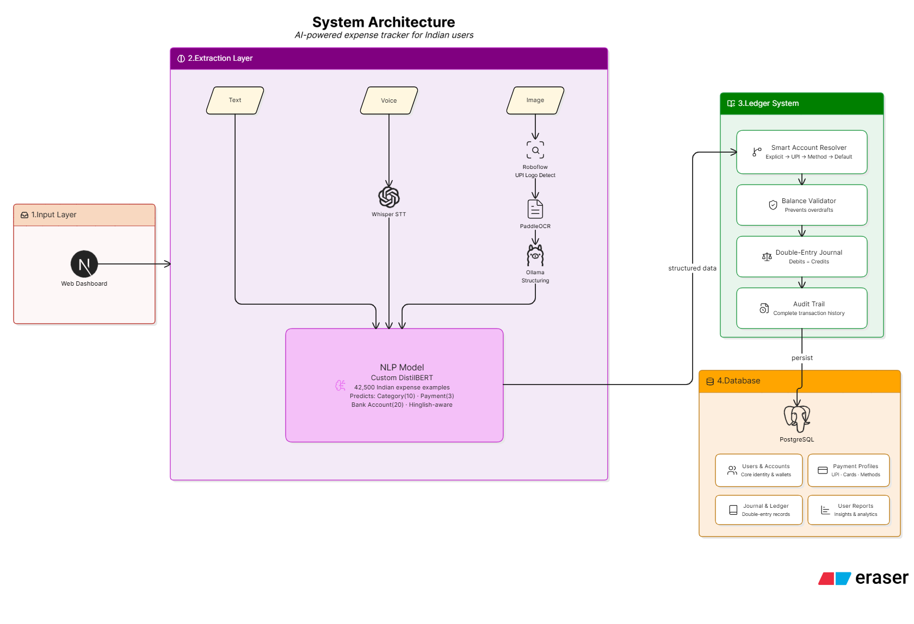
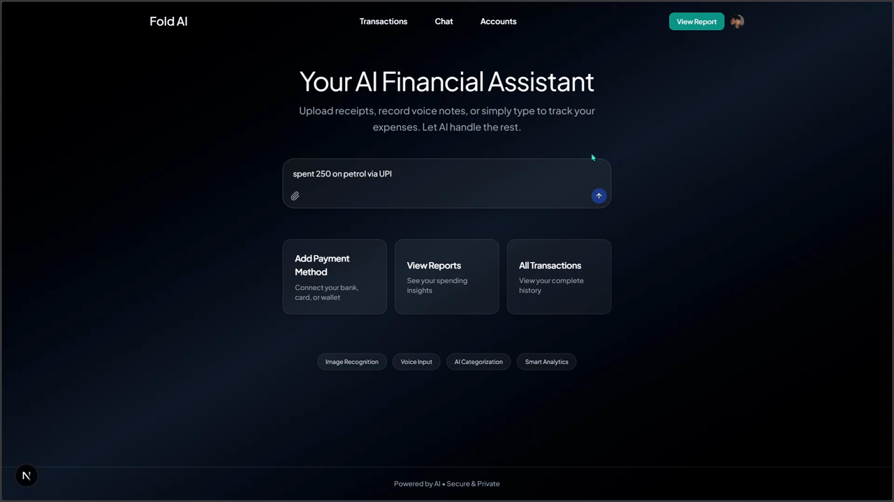
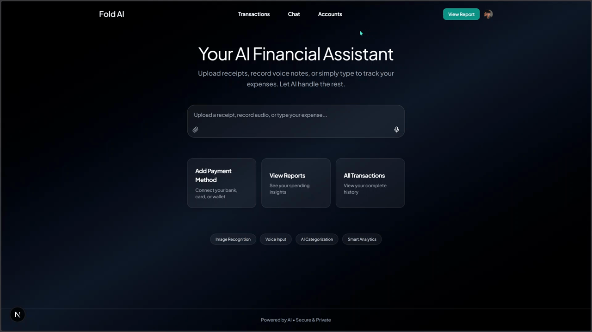
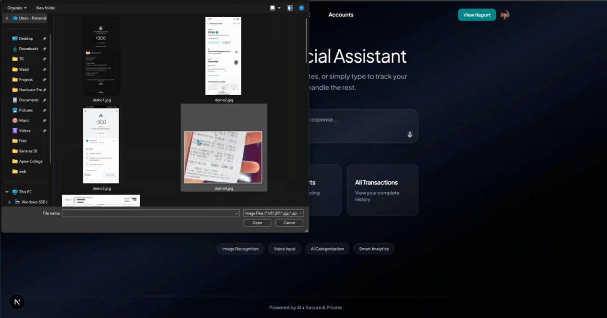
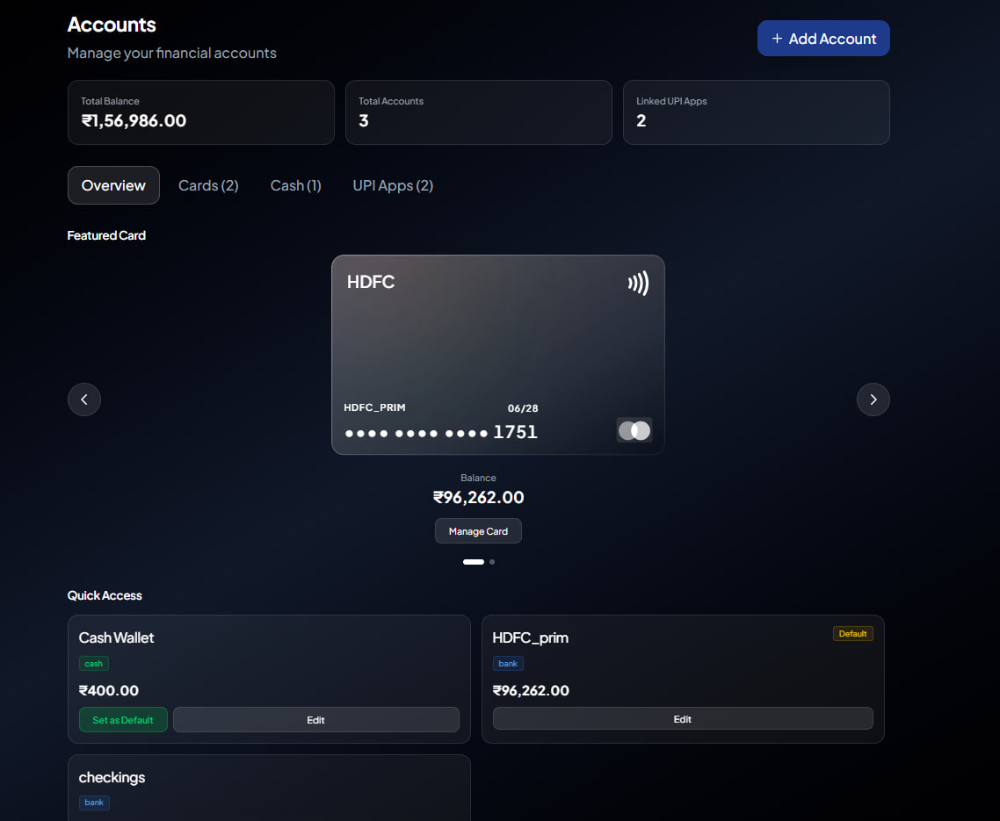
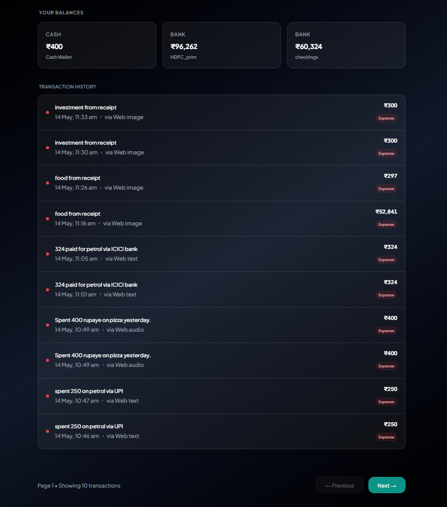

<div align="center">
<h1>💰 Fold</h1>
<p><strong>AI-Powered Multi-Modal Expense Tracking for India</strong></p>
<p>Track expenses naturally—just speak, snap a receipt, or type. Fold understands Hinglish, extracts transaction details automatically, and maintains professional double-entry accounting. Built specifically for the Indian payment ecosystem.</p>
</div>

---

## 🚀 See Fold in Action

*Watch how Fold processes expenses from voice notes, UPI screenshots, and text messages—all in Hinglish.*

> **[🎥 Full Demo Video Coming Soon]**  
> *Complete walkthrough of all features: voice input, image processing, text extraction, account management, and reports*

---

## 🏗️ How It Works (System Architecture)

Fold uses a sophisticated multi-stage pipeline to extract financial data from any input modality. The system is built for ultra-low latency with synchronous processing—no queues, no polling, just instant results.



**Processing Flow:**
1. **Input Layer:** Text, voice notes, or images (receipts/UPI screenshots)
2. **Extraction Pipeline:** Modality-specific processing (STT for audio, OCR for images)
3. **NLP Classification:** Custom-trained DistilBERT model predicts category, payment method, and bank account
4. **Ledger System:** Professional double-entry accounting with balance validation
5. **Response:** Instant confirmation with transaction details

---

## ✨ Core Features & Showcase

Fold isn't just an expense tracker—it's a complete financial management system with AI-powered intelligence.

### 1. Multi-Modal Input Processing

Fold accepts expenses in **any format** you prefer—no forms, no dropdowns, just natural input.

**📝 Text Input:**
```
"Paid 450 for Swiggy order via GPay"
"100 rupay ka chai piya"  (Hinglish)
"₹1,200 - Electricity bill - HDFC card"
```



**🎤 Voice Input:**
Record voice notes in Hindi, English, or Hinglish. Fold uses OpenAI Whisper to transcribe and automatically extracts transaction details.



**📸 Image Input:**
- UPI payment screenshots (GPay, PhonePe, Paytm, etc.)
- Physical receipts and bills
- Bank statements

Fold automatically detects payment provider logos, extracts amounts, merchants, and payment methods using computer vision + OCR.



---

### 2. Intelligent AI Extraction & Categorization

Fold's custom-trained NLP model understands the Indian payment ecosystem and Hinglish naturally.

**What Fold Extracts:**
- ✅ **Amount:** Handles ₹ symbol, Hindi number words (हजार, लाख), currency formats
- ✅ **Category:** 10 categories (food, travel, shopping, entertainment, healthcare, education, utilities, EMI, investment, friends)
- ✅ **Payment Method:** UPI, card, cash
- ✅ **Payment Provider:** GPay, PhonePe, Paytm, Slice, Jupiter, Fi, Niyo, CRED, etc.
- ✅ **Bank/Account:** HDFC, ICICI, SBI, Axis, Kotak, and 15+ other Indian banks
- ✅ **Merchant/Description:** What the expense was for
- ✅ **Cash Flow:** Automatically detects expense vs income

**The NLP Engine:**
- **Model:** Fine-tuned DistilBERT with 3 classification heads
- **Training Data:** 42,500+ custom-generated examples
- **Accuracy:** ~94% category, ~98% payment method, ~91% bank account
- **Languages:** English, Hindi, Hinglish (code-mixed)


---

### 3. Smart Account Resolution & Payment Profiles

Fold automatically figures out **which account to charge** based on payment method.

**Example:**
- You say: "Paid via GPay"
- Fold knows: Your GPay is linked to HDFC Bank
- Result: HDFC Bank account is automatically debited

**Account Types:**
- 💳 **Bank Accounts:** Savings/current with institution name and last 4 digits
- 💰 **Cash Wallets:** Physical cash tracking
- 🏦 **Credit Cards:** Debt tracking (can have negative balances)
- 📱 **UPI Apps:** Linked to bank accounts (GPay → HDFC, PhonePe → Axis, etc.)

**Supported Payment Providers:**
GPay, PhonePe, Paytm, BHIM, CRED, BharatPe, Amazon Pay, Slice, Jupiter, Fi, Niyo, Freecharge, Mobikwik



---

### 4. Professional Double-Entry Accounting

Fold implements **real double-entry bookkeeping**—the same system used by accountants and businesses.

**Every transaction creates balanced journal entries:**
- **Expense:** Debit "Expense Account" → Credit "Funding Account" (bank/UPI/cash)
- **Income:** Debit "Destination Account" → Credit "Income Account"
- **Investment:** Debit "Investment Portfolio" → Credit "Funding Account"
- **Transfer:** Debit "To Account" → Credit "From Account"

**Why This Matters:**
- ✅ **Accuracy:** Every rupee is accounted for (debits always equal credits)
- ✅ **Audit Trail:** Complete history of where money came from and went to
- ✅ **Professional:** Same system used by businesses and accountants
- ✅ **Integrity:** Database constraints prevent data corruption
- ✅ **Reporting:** Easy to generate balance sheets, income statements, cash flow reports

**Balance Protection (3-Layer Guardrails):**
1. Database constraint prevents negative balances on cash/bank accounts
2. Application layer validates balance before every transaction
3. Frontend shows clear error messages



**Balance Validation:**
Fold prevents overspending by validating account balances before processing transactions. If your bank balance is less than the expense amount, the transaction is rejected with a clear error message.


---

### 5. Comprehensive Reports & Analytics

Get instant insights into your spending patterns with beautiful visualizations.

**Weekly Reports:**
- 7-day rolling window
- Total income, expenses, investments, net savings
- Top spending categories
- Breakdown by payment method
- Top 5 individual expenses

**Monthly Reports:**
- Current month-to-date
- Same metrics as weekly
- Longer-term trend analysis

**Dashboard Visualizations:**
- 📊 Category pie charts
- 📈 Daily spending trends
- 💹 Income vs expense comparison
- 💳 Account balance cards
- 🔝 Top expenses list
- 📋 Transaction history table


---

### 6. Multi-Platform Access

**🤖 Telegram Bot:**
Full-featured interface with inline keyboards and wizards.

**Commands:**
- `/expense` — Quick expense posting
- `/income` — Record income
- `/investment` — Track investments
- `/transfer` — Transfer between accounts
- `/balance` — Check account balances
- `/weekly` — 7-day spending report
- `/monthly` — Month-to-date report

**Features:**
- Voice note support (Hinglish/Hindi/English)
- Image upload for receipts
- Interactive category correction
- Inline dashboard with action buttons
- Onboarding wizard for account setup

**🌐 Web Dashboard:**
Modern Next.js interface with Clerk authentication.

**Features:**
- Real-time dashboard with charts and graphs
- Transaction history with filtering
- Account management (add banks, link UPI apps)
- Period toggle (weekly/monthly views)
- Responsive design for mobile/desktop
- Multi-modal input (text, audio, image upload)

**🔌 REST API:**
Full programmatic access for developers.

---

## 📊 The Complete Pipeline

### Text Processing (~1 second)
```
User Input: "450 rupay Swiggy GPay"
    ↓
NLP Extraction (DistilBERT)
    ├── Amount: ₹450
    ├── Category: food
    ├── Payment Method: upi
    ├── Payment Provider: gpay
    └── Bank: hdfc (from GPay profile)
    ↓
Ledger Posting (Double-Entry)
    ├── Debit: expense_operating ₹450
    └── Credit: hdfc_bank ₹450
    ↓
Response: "Saved food expense of ₹450. Paid from: HDFC Bank (via GPay). Journal #142."
```

---

### Voice Processing (~3-5 seconds)
```
User Input: Voice note "bees rupay ka chai piya"
    ↓
Whisper STT (Speech-to-Text)
    ↓ Transcript: "bees rupay ka chai piya"
    ↓
NLP Extraction (DistilBERT)
    ├── Amount: ₹20 (Hindi number word)
    ├── Category: food
    ├── Payment Method: cash
    └── Bank: cash_wallet
    ↓
Ledger Posting
    ↓
Response: "Recorded ₹20.00 — chai. Category: food. Paid from: Cash Wallet."
```

---

### Image Processing (~5-7 seconds)
```
User Input: UPI screenshot or receipt photo
    ↓
Stage 1: UPI Logo Detection (Roboflow) ~500ms
    └── Detects: GPay logo → Provider: gpay
    ↓
Stage 2: OCR Text Extraction (PaddleOCR) ~2-3s
    ├── Extracts all text lines
    ├── Spatial sorting
    ├── Keyword scanning (Total, Amount, ₹)
    └── Heuristic parsing (amount, payment method, last4)
    ↓
Stage 3: LLM Structuring (Ollama, optional) ~1-2s
    ├── Converts raw OCR to structured JSON
    ├── Handles typos and OCR noise
    └── Extracts: amount, merchant, payment details
    ↓
Stage 4: NLP Classification (DistilBERT) ~500ms
    ├── Category prediction (10 classes)
    ├── Payment method validation
    └── Bank account prediction
    ↓
Stage 5: Result Merging <100ms
    ├── Amount: Ollama → OCR → NLP (priority)
    ├── Payment Provider: UPI detection → Ollama → OCR
    ├── Category: NLP (most accurate)
    └── Bank: Ollama → NLP
    ↓
Ledger Posting
    ↓
Response: Full transaction details with extracted data
```

**Why This Complex Pipeline?**
- **UPI screenshots:** Clean, structured → Ollama excels
- **Physical receipts:** Noisy, varied layouts → OCR heuristics catch edge cases
- **Robustness:** Multiple extraction methods provide fallbacks
- **Accuracy:** Each stage specializes in what it does best

---

## ⚙️ Technology Stack

### Backend
- **Language:** Python 3.11
- **Framework:** FastAPI (async web framework)
- **Database:** PostgreSQL (Supabase-hosted)
- **Server:** Uvicorn (ASGI server)

### Machine Learning
- **NLP Model:** DistilBERT (HuggingFace Transformers)
- **Framework:** PyTorch
- **OCR:** PaddleOCR 2.10
- **STT:** OpenAI Whisper (local "small" model)
- **Computer Vision:** Roboflow Inference API
- **LLM:** Ollama (local, llama3.2:3b model)

### Frontend
- **Framework:** Next.js 16 (React 19)
- **Styling:** Tailwind CSS 4
- **Charts:** Recharts
- **Authentication:** Clerk (OAuth, magic links)
- **Language:** TypeScript

### Infrastructure
- **Bot Platform:** Telegram Bot API
- **Processing Model:** Synchronous (no queues, no workers)
- **Deployment:** Self-hosted / Cloud-ready

---

## 🎯 Target Users

### 1. **Students**
Track daily expenses, manage pocket money, stay within budget. No manual entry—just snap a receipt or say "50 rupees chai."

### 2. **Everyday Users**
Monitor household spending, bills, and personal finances. Consolidates all payment methods (bank, UPI, cash, credit cards) in one place.

### 3. **Small Business Owners / Freelancers**
Maintain detailed financial records, analyze spending patterns, export data for accounting. Professional-grade accounting without complex software.

### 4. **Hinglish Speakers**
Communicate naturally in mixed Hindi-English. No need to translate—speak/type as you normally would.

---

## 🚀 Key Capabilities at a Glance

- **Multi-Modal Input:** Text, voice, and images processed with equal intelligence
- **Hinglish Support:** Natural language understanding of code-mixed Hindi-English
- **Indian Payment Ecosystem:** Built specifically for UPI, Indian banks, and payment apps
- **Smart Account Resolution:** Automatically figures out which account to charge
- **Professional Accounting:** Double-entry ledger system with balance validation
- **Privacy-Focused:** All ML models run locally, no data sent to cloud AI services
- **Zero Learning Curve:** Natural language input, no forms or categories to remember
- **Continuous Learning:** Gets smarter from user corrections
- **Real-Time Processing:** Synchronous pipeline with instant feedback (<7s for images)
- **Multi-Platform:** Telegram bot + Web dashboard + REST API

---

## 📈 Model Performance

**NLP Classification (DistilBERT v3):**
- **Category Accuracy:** ~94% (10 classes)
- **Payment Method Accuracy:** ~98% (3 classes)
- **Bank Account Accuracy:** ~91% (20 classes)
- **Training Data:** 42,500+ examples
- **Inference Time:** ~500ms

**OCR Extraction (PaddleOCR):**
- **Text Extraction:** ~2-3 seconds
- **Amount Detection:** 85%+ accuracy with plausibility filters
- **UPI Logo Detection:** 90%+ accuracy (Roboflow)

**Speech-to-Text (Whisper):**
- **Transcription Time:** ~2-4 seconds
- **Language Support:** Hindi, English, Hinglish
- **Accuracy:** High for financial domain with custom prompts

---

## 🎓 What Makes Fold Unique?

1. **India-First Design:** Built specifically for Indian payment ecosystem (UPI, Indian banks, Hinglish)
2. **Multi-Modal Intelligence:** Understands text, voice, and images equally well
3. **Professional Accounting:** Double-entry ledger system, not just expense tracking
4. **Privacy-Focused:** All ML models run locally, no data sent to cloud AI services
5. **Zero Learning Curve:** Natural language input, no forms or categories to remember
6. **Telegram Integration:** Full functionality without installing an app
7. **Smart Account Resolution:** Automatically figures out which account to charge based on payment method
8. **Continuous Learning:** Gets smarter from user corrections
9. **Synchronous Processing:** Instant feedback, no queues or polling
10. **Open Architecture:** REST API for programmatic access

---

## 🔮 Future Enhancements

- **Recurring Expense Detection:** Automatically identify subscriptions and recurring bills
- **Budget Alerts:** Set category-wise budgets and get notifications
- **Expense Splitting:** Split bills with friends and track who owes what
- **Tax Reports:** Generate tax-ready expense reports by category
- **Bank Statement Import:** Bulk import from bank CSV/PDF statements
- **Investment Tracking:** Track mutual funds, stocks, and portfolio performance
- **Multi-Currency Support:** Handle international transactions
- **Mobile App:** Native iOS/Android apps with offline support

---

<div align="center">
<p><em>Built to make expense tracking effortless for India.</em></p>
<p><strong>Track naturally. Understand instantly. Stay in control.</strong></p>
</div>
