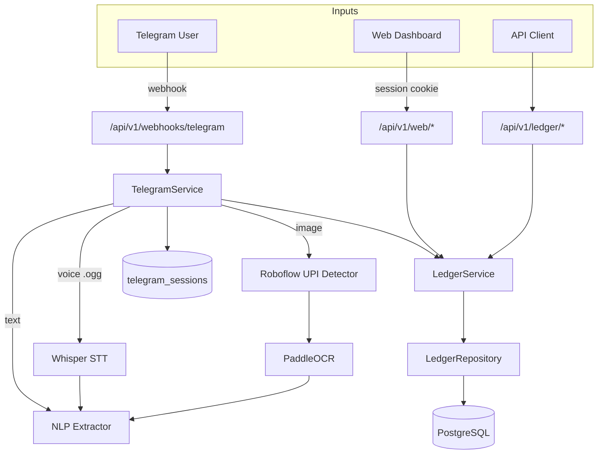

# Fold — Context & Engineering Memory

This is the single source of truth for the Fold backend and frontend architecture. It describes what is built, why it was built that way, how each subsystem works, and what is still planned.

Last updated: **2026-04-14** (after v3 NLP model deployment).

---

## Table of Contents

1. [Project Overview](#project-overview)
2. [Architecture & Data Flow](#architecture--data-flow)
3. [Directory Structure](#directory-structure)
4. [Environment & Configuration](#environment--configuration)
5. [Database Schema](#database-schema)
6. [Extraction Pipeline (OCR / STT / NLP)](#extraction-pipeline-ocr--stt--nlp)
7. [Ledger System (Double-Entry Accounting)](#ledger-system-double-entry-accounting)
8. [Telegram Bot](#telegram-bot)
9. [Web Dashboard](#web-dashboard)
10. [API Surface](#api-surface)
11. [NLP Model — Training & Inference](#nlp-model--training--inference)
12. [Funding Account Resolution](#funding-account-resolution)
13. [Known Gaps & Next Steps](#known-gaps--next-steps)

---

## Project Overview

Fold is a multi-modal expense tracking system optimized for Indian/Hinglish usage. Users interact through a Telegram bot (text, voice, images) or a Next.js web dashboard. The backend extracts financial data from any modality, classifies it, and posts double-entry accounting journals to a PostgreSQL ledger.

### Core Principles

1. **Ledger is source of truth** — all reports derive from posted journal entries, never from model guesses.
2. **Double-entry accounting enforced at write-time** — every journal balances (debits == credits).
3. **Single currency model (INR)** — simplifies storage, minor-unit arithmetic, and reporting.
4. **Telegram is a first-class client** — full dashboard, wizards, and inline keyboards; not a thin relay.
5. **Extraction stays separate from accounting** — OCR/STT/NLP produces structured data; the ledger service decides how to post it.
6. **Roboflow-first image routing** — UPI logo detection determines the OCR preprocessing path before any extraction begins.

### Technology Stack

| Layer | Technology |
|---|---|
| **Backend** | Python 3.11 · FastAPI · Uvicorn |
| **Database** | PostgreSQL (Supabase-hosted) · psycopg 3 |
| **NLP** | DistilBERT (fine-tuned, multi-head v3) · PyTorch · HuggingFace Transformers |
| **OCR** | PaddleOCR 2.10 (PaddlePaddle 2.6.2) |
| **STT** | OpenAI Whisper (local, `small` model) |
| **UPI Detection** | Roboflow Inference API |
| **Frontend** | Next.js 16 · React 19 · Tailwind CSS 4 · Recharts |
| **Bot** | Telegram Bot API (webhooks) |

---

## Architecture & Data Flow



### Request lifecycle (Telegram expense)

1. Telegram sends a webhook POST to `/api/v1/webhooks/telegram`.
2. `TelegramService.handle_update()` dispatches by message type (text command, voice, photo, callback query).
3. For voice/image: the media file is downloaded, processed through STT/OCR, then passed to NLP.
4. NLP returns `{amount, category, payment_method, payment_provider, bank_account, cash_flow}`.
5. `TelegramService` builds an `ExpenseRequest` and calls `LedgerService.post_expense()`.
6. `LedgerService` resolves the funding account, converts to minor units, validates, and calls `LedgerRepository.create_balanced_journal()`.
7. The repository posts a journal header + 2 ledger entries (debit expense, credit funding) in a single DB transaction.
8. The bot replies with amount, description, category, paid-from account, and journal ID.

---

## Directory Structure

```
Fold/
├── .env.example                    # Required env vars template
├── .gitignore
├── context.md                      # This file
├── requirements.txt                # Python dependencies (pinned)
├── test_api.py                     # Manual HTTP smoke tests
├── test_transactions.csv           # Seed transaction data
├── src/
│   ├── api/
│   │   ├── main.py                 # FastAPI app, CORS, startup hooks
│   │   ├── routes.py               # /extract/* and /correct endpoints
│   │   ├── schemas.py              # Pydantic request/response models
│   │   ├── config.py               # Settings from .env
│   │   ├── db/
│   │   │   └── connection.py       # DB connection, schema DDL, migrations
│   │   ├── controllers/
│   │   │   ├── ledger_controller.py    # /ledger/* HTTP handlers
│   │   │   ├── telegram_controller.py  # /webhooks/telegram
│   │   │   └── web_controller.py       # /web/* dashboard API
│   │   ├── middleware/
│   │   │   └── telegram_security.py    # Webhook secret validation
│   │   ├── repositories/
│   │   │   └── ledger_repository.py    # All SQL / data access
│   │   └── services/
│   │       ├── ledger_service.py       # Double-entry posting logic
│   │       ├── telegram_service.py     # Bot command/callback handling
│   │       └── web_auth_service.py     # Magic-link auth + sessions
│   ├── nlp/
│   │   ├── inference.py                # TransactionExtractor (v1 + v3)
│   │   ├── augment_dataset.py          # v1/v2 dataset generator
│   │   ├── augment_dataset_v3.py       # v3 dataset generator (42.5k rows)
│   │   ├── model.ipynb                 # v1 training notebook
│   │   ├── model_v3.ipynb              # v3 multi-head training notebook
│   │   ├── category_overrides.json     # User correction memory
│   │   ├── eda_dataset_v2.csv          # v2 training data
│   │   ├── eda_dataset_v3.csv          # v3 training data (current)
│   │   └── my_finetuned_distilbert_v3/ # Deployed model checkpoint
│   │       ├── config.json
│   │       ├── model.safetensors       # DistilBERT encoder weights
│   │       ├── heads.pt               # 3 classification head weights
│   │       ├── label_maps_v3.json      # Index → label mappings
│   │       ├── tokenizer.json
│   │       └── tokenizer_config.json
│   ├── ocr/
│   │   ├── extractor.py            # PaddleOCR receipt pipeline
│   │   ├── amount_plausibility.py  # Numeric false-positive filters
│   │   ├── cash_flow.py            # Expense vs income heuristics
│   │   └── upi_detector.py         # Roboflow UPI logo detection
│   └── stt/
│       └── transcriber.py          # Whisper voice transcription
└── web/
    ├── package.json
    ├── next.config.ts
    ├── tsconfig.json
    ├── src/
    │   ├── app/
    │   │   ├── layout.tsx          # Root layout
    │   │   ├── page.tsx            # Dashboard home
    │   │   ├── globals.css         # Tailwind globals
    │   │   ├── login/page.tsx      # Magic-link login
    │   │   └── transactions/page.tsx
    │   ├── components/
    │   │   ├── DashboardClient.tsx  # Main dashboard (auth, charts, tables)
    │   │   ├── SummaryCards.tsx     # KPI cards
    │   │   ├── BalanceCards.tsx     # Account balance cards
    │   │   ├── CategoryChart.tsx   # Category pie/donut
    │   │   ├── CategoryBarChart.tsx
    │   │   ├── DailyTrendChart.tsx  # Time series
    │   │   ├── SpendVsIncomeChart.tsx
    │   │   ├── BreakdownList.tsx
    │   │   ├── TopExpenses.tsx
    │   │   ├── TransactionTable.tsx
    │   │   ├── PeriodToggle.tsx    # Weekly/monthly switcher
    │   │   └── ui/                 # Primitives (card, badge)
    │   └── lib/
    │       ├── api.ts              # Typed fetch helpers
    │       ├── format.ts           # Currency/date formatting
    │       └── utils.ts            # cn() and shared utils
    └── public/                     # Static SVG assets
```

---

## Environment & Configuration

**File:** `src/api/config.py`

Settings are loaded from `.env` at project root. The loader prefers `.env` values over shell environment.

| Variable | Required | Description |
|---|---|---|
| `DATABASE_URL` | Yes | PostgreSQL connection string |
| `TELE_BOT_HTTP_API` | Yes | Telegram bot HTTP API token |
| `TELEGRAM_WEBHOOK_SECRET` | No | Validates `X-Telegram-Bot-Api-Secret-Token` header |
| `ROBOFLOW_API_KEY` | No | Roboflow inference API key |
| `ROBOFLOW_UPI_MODEL_ID` | No | Model ID for UPI logo detection (default: `document-classification/upi/1`) |
| `MAX_TRANSACTION_INR` | No | Per-transaction cap in INR (default: `1,000,000`) |
| `FOLD_RESET_DATABASE` | No | Set to `1` for one-time destructive schema reset |
| `FOLD_WEB_ORIGINS` | No | Comma-separated CORS origins for Next.js (default: `http://localhost:3000`) |
| `FOLD_WEB_SIGNING_SECRET` | No | HMAC secret for magic-link tokens (auto-generated if absent) |

**Startup sequence** (`main.py`):
1. `run_migrations()` — calls `ensure_schema()` (create-if-missing, no data wipe). Destructive reset only when `FOLD_RESET_DATABASE=1`.
2. `register_telegram_bot_commands()` — sets the Telegram `/` command menu.

---

## Database Schema

**File:** `src/api/db/connection.py` (embedded DDL, no Alembic migrations yet)

### Tables

| Table | Purpose |
|---|---|
| `users` | `id`, `external_user_ref` (unique), `preferences_json`, `created_at` |
| `accounts` | User-scoped chart of accounts. Fields: `code`, `name`, `account_type` (asset/liability/equity/income/expense/investment), `institution_name`, `account_number_last4`, `is_digital`, `currency`, `is_active` |
| `payment_profiles` | UPI/card/wallet/bank_app profiles. Optional `linked_account_id` → `accounts`. Fields: `profile_type`, `provider`, `profile_name`, `handle_ref` |
| `journal_transactions` | One row per business event. `source`, `description`, `external_ref`, `transaction_type` (expense/income/investment/transfer/opening_balance), `occurred_at`, `metadata_json`. Unique on `(user_id, source, external_ref)` with nulls distinct |
| `journal_media` | Binary media (`file_bytes`) attached to a journal |
| `ledger_entries` | Double-entry lines: `journal_transaction_id`, `account_id`, `debit`/`credit`, `amount_minor`, `currency` |
| `telegram_sessions` | Bot FSM state per `telegram_user_id`. Stores `state`, `payload_json`, `funding_account_code/type` |
| `telegram_expense_pending_media` | Pending image/audio keyed by `telegram_user_id` for multi-step flows |
| `ingestion_events` | Idempotency/audit. Unique `(source, external_event_id)` |

### Connection management

- Per-request connections via `get_db_connection()` context manager.
- 3-attempt retry with backoff on `getaddrinfo failed` (transient DNS resolution errors, common on Windows).
- No connection pooling — adequate for current single-user load.

---

## Extraction Pipeline (OCR / STT / NLP)

### Image Pipeline (Roboflow → OCR → NLP)

**Files:** `src/ocr/upi_detector.py`, `src/ocr/extractor.py`, `src/nlp/inference.py`

1. **Roboflow UPI logo detection** runs first on every image.
2. **If UPI logo detected:** OCR runs in raw mode (`use_preprocessing=False`) — PaddleOCR's internal CNNs work best on clean screenshots.
3. **If no UPI logo:** OCR runs with preprocessing (`use_preprocessing=True`) — OpenCV pipeline (grayscale, CLAHE, denoise, sharpen, binarize) for noisy physical receipts.
4. OCR output goes through spatial sorting (reconstruct lines from bounding boxes) and heuristic filtering (keyword scan for Total/Amount/₹).
5. `extract_payment_details()` parses amounts and payment modes from filtered lines.
6. OCR text wall is fed to NLP for category classification and enrichment.
7. **Merge policy:**
   - Amount: OCR first, NLP fallback. UPI evidence → NLP amount priority; invoice → OCR amount priority.
   - Payment method: OCR first, NLP fallback.
   - Category: NLP always.
   - Bank account: NLP (v3 model prediction).

### Voice Pipeline (Whisper → NLP)

**File:** `src/stt/transcriber.py`

1. Audio file (.ogg, .wav, .mp3) decoded via FFmpeg.
2. Whisper `small` model transcribes with `language="hi"` and a Hinglish domain prompt.
3. Raw transcript passed to NLP extractor.

### Text Pipeline (NLP only)

User text goes directly to `TransactionExtractor.extract()`.

### OCR Support Modules

| Module | Purpose |
|---|---|
| `amount_plausibility.py` | Rejects ID-sized numbers, year-in-date-context, and bank-last4 misreads as amounts. `plausible_inr_amount()` enforces a sane range |
| `cash_flow.py` | Detects expense vs income from UPI phrases ("paid to" → expense, "received from" → income) |
| `upi_detector.py` | Roboflow HTTP client for UPI app logo detection. Returns logo class and confidence |

---

## Ledger System (Double-Entry Accounting)

**Files:** `src/api/services/ledger_service.py`, `src/api/repositories/ledger_repository.py`

### Accounting Templates

| Transaction Type | Debit | Credit |
|---|---|---|
| **Expense** | `expense_operating` (pooled) | Funding account (bank/UPI/cash) |
| **Income** | Destination asset account | `income_operating` (pooled) |
| **Investment** | `investment_portfolio` (pooled) | Funding account |
| **Transfer** | Destination account | Source account |
| **Opening Balance** | Target account | `opening_equity` |

### Key Business Rules

- **Amount cap:** `MAX_TRANSACTION_INR` (default ₹10 lakh) rejects absurd OCR-derived amounts.
- **Balance preflight:** Asset funding accounts are checked for sufficient balance before posting expenses, investments, and transfers.
- **Minor-unit storage:** All amounts stored as integer paisa (`amount * 100`) to avoid float drift.
- **Pooled accounts:** Expenses, income, and investments use single pooled ledger codes. Category lives in `metadata_json`, not in separate `expense_food` / `expense_travel` accounts.
- **Category correction:** `reassign_expense_journal_category()` updates `metadata_json` only — no ledger line movement.
- **Idempotency:** `(user_id, source, external_ref)` uniqueness on `journal_transactions`.

### Data Classes

```python
ExpenseRequest(user_ref, source, description, amount,
    expense_account_code, funding_account_code, funding_account_type,
    external_ref, occurred_at, category, payment_method,
    payment_provider, receipt_account_last4, receipt_institution_hint,
    bank_hint)

IncomeRequest(user_ref, source, description, amount, ...)
InvestmentRequest(user_ref, source, description, amount, ...)
TransferRequest(user_ref, source, description, amount,
    from_account_code, from_account_type,
    to_account_code, to_account_type, ...)
OpeningBalanceRequest(user_ref, source, description, amount,
    target_account_code, target_account_type, ...)
```

---

## Telegram Bot

**File:** `src/api/services/telegram_service.py` (~2100 lines)

### Commands

| Command | Behavior |
|---|---|
| `/start` | Sends inline dashboard with action buttons |
| `/expense [amount] [note]` | Quick expense posting (NLP parses text for amount/category/payment) |
| `/income [amount] [note]` | Quick income posting |
| `/investment [amount] [note]` | Quick investment posting |
| `/transfer` | Initiates transfer wizard |
| `/opening` | Initiates opening balance wizard |
| `/balance` | Shows asset/liability account balances |

### Dashboard Inline Buttons

Add Expense · Add Income · Add Investment · Transfer · Weekly Report · Monthly Report · Balance Snapshot · Accounts · Add bank / Link UPI

### Multi-Modal Input

- **Text messages** (without command prefix): processed through NLP and posted as expense.
- **Voice notes:** downloaded → Whisper STT → NLP → posted as expense.
- **Photos:** downloaded → Roboflow → OCR → NLP → posted as expense with debug info (amount_source, upi_evidence, payment_provider).

### Session Management

`telegram_sessions` stores per-user FSM state: current wizard step, pending payload, and default funding account preference.

### Category Correction

After every expense, the bot shows a "Change category" button. Tapping it reveals category picks. Selecting a category calls `LedgerService.reassign_expense_journal_category()` which updates `metadata_json` in the journal.

### Onboarding Flow

1. User sends `/start` → bot checks `get_onboarding_status()`.
2. If no accounts: prompts to add a bank account (name, institution, last4).
3. After bank setup: prompts to add cash wallet, link UPI apps.
4. UPI link wizard: select provider → pick bank account → name profile → optional handle.
5. "Add bank / Link UPI" always available on dashboard for adding more accounts later.

### Response Format (Text Expense)

After posting, the bot replies with:
```
Recorded ₹450.00 — Swiggy pizza order
Category: food. Paid from: slice_bank. Journal #42.
Wrong category? Tap Change category.
```

### Reports

- **Weekly:** 7-day rolling window. Shows totals (income/expense/investment/net), top categories, by payment method.
- **Monthly:** `max(1, day_of_month)` days rolling. Same structure.
- Message auto-truncated near 4000 chars (Telegram limit).

---

## Web Dashboard

**Directory:** `web/` (Next.js 16 + React 19 + Tailwind CSS 4)

### Authentication

1. Telegram bot issues a signed magic-link token via `web_auth_service.issue_magic_token()`.
2. User clicks link → `GET /api/v1/web/auth/exchange?token=...` validates and sets `fold_session` cookie.
3. Tokens are single-use, 5-minute TTL. Sessions last 7 days.
4. All `/api/v1/web/*` endpoints require valid session cookie.

### Pages

| Route | Component | Description |
|---|---|---|
| `/` | `DashboardClient.tsx` | Main dashboard: period toggle, summary cards, balance cards, charts, top expenses |
| `/login` | `login/page.tsx` | Magic-link token exchange |
| `/transactions` | `transactions/page.tsx` | Full transaction history table |

### Dashboard Components

- **SummaryCards** — KPI totals (income, expense, investment, net)
- **BalanceCards** — Per-account balances
- **CategoryChart / CategoryBarChart** — Spending by category
- **DailyTrendChart** — Time series of daily spend
- **SpendVsIncomeChart** — Income vs expense comparison
- **BreakdownList** — Detailed breakdown by category/account/method
- **TopExpenses** — Highest individual transactions
- **PeriodToggle** — Weekly/monthly switcher
- **TransactionTable** — Paginated transaction list

### API Layer

`web/src/lib/api.ts` provides typed fetch wrappers for:
- `GET /api/v1/web/auth/me` — current session
- `GET /api/v1/web/dashboard?period=weekly|monthly` — aggregated dashboard data
- `GET /api/v1/web/transactions?limit=&offset=` — paginated transactions

---

## API Surface

### Extraction APIs (`/api/v1`)

| Method | Endpoint | Input | Output |
|---|---|---|---|
| POST | `/extract/text` | `{ text }` | `TransactionResponse` |
| POST | `/extract/audio` | audio file upload | `TransactionResponse` |
| POST | `/extract/image` | image file upload | `TransactionResponse` |
| POST | `/correct` | `{ keyword, correct_category }` | Saves to `category_overrides.json` |
| POST | `/extract/image/debug-upi` | image file upload | Roboflow UPI detection result |

**TransactionResponse** shape:
```json
{
  "status": "success",
  "source": "text|audio|image",
  "data": {
    "text_transcript": "...",
    "amount": 450.0,
    "category": "food",
    "payment_method": "upi",
    "payment_provider": "slice",
    "bank_account": "slice",
    "cash_flow": "expense"
  }
}
```

### Ledger APIs (`/api/v1/ledger`)

| Method | Endpoint | Description |
|---|---|---|
| POST | `/expense` | Post expense journal |
| POST | `/income` | Post income journal |
| POST | `/investment` | Post investment journal |
| POST | `/transfer` | Post transfer journal |
| POST | `/opening-balance` | Post opening balance |
| POST | `/accounts` | Create/upsert account |
| GET | `/accounts/{user_ref}` | List user's accounts |
| PUT | `/accounts/{user_ref}/primary-funding` | Set default funding account |
| POST | `/payment-profiles` | Create/upsert payment profile |
| GET | `/payment-profiles/{user_ref}` | List payment profiles |
| GET | `/onboarding-status/{user_ref}` | Check setup completeness |
| GET | `/balances/{user_ref}` | Account balances |
| GET | `/reports/weekly/{user_ref}` | Weekly summary |
| GET | `/reports/monthly/{user_ref}` | Monthly summary |
| GET | `/reports/cashflow/{user_ref}` | Cash flow report |
| GET | `/reports/breakdown/{user_ref}` | Breakdown by category/account/method |
| GET | `/transactions/{user_ref}` | Paginated transaction history |

### Web Dashboard APIs (`/api/v1/web`)

| Method | Endpoint | Description |
|---|---|---|
| GET | `/auth/exchange` | Exchange magic token for session cookie |
| GET | `/auth/me` | Current session info |
| POST | `/auth/logout` | Destroy session |
| GET | `/dashboard` | Aggregated dashboard data |
| GET | `/transactions` | Paginated transactions |

### Webhook

| Method | Endpoint | Description |
|---|---|---|
| POST | `/api/v1/webhooks/telegram` | Telegram bot webhook (optionally secret-validated) |

---

## NLP Model — Training & Inference

### Model Architecture (v3 — current)

**Multi-head DistilBERT** with a shared encoder and three separate classification heads:

```
DistilBERT Encoder (768-dim CLS token)
  ├── head_cat    → Linear(768, 10)   [category]
  ├── head_method → Linear(768, 3)    [payment_method]
  └── head_bank   → Linear(768, 20)   [bank_account]
```

**Training loss:** `CrossEntropy(category) + 0.5 * CrossEntropy(method) + 0.5 * CrossEntropy(bank)`

### Label Maps (from `label_maps_v3.json`)

**Categories (10):** education, emi, entertainment, food, friends, healthcare, investment, shopping, travel, utilities

**Payment Methods (3):** card, cash, upi

**Bank Accounts (20):** axis, bandhan, bob, canara, federal bank, fi, hdfc, icici, idfc, indusind, jupiter, kotak, niyo, pnb, rbl, sbi, slice, union bank, unknown, yes bank

### Inference Flow (`TransactionExtractor.extract()`)

```
Input text
  │
  ├── Regex: amount extraction (Hindi multipliers → currency-tagged → bare number fallback)
  ├── Regex: payment method keywords (UPI / card / cash)
  ├── Regex: UPI provider map (gpay, phonepe, paytm, slice, jupiter, fi, niyo, ...)
  ├── Regex: Indian bank name dictionary
  ├── Heuristic: cash flow detection (expense vs income)
  │
  └── v3 Multi-Head DistilBERT:
        ├── category prediction
        ├── payment_method prediction
        └── bank_account prediction
  │
  └── Merge: model predictions are primary; regex fills gaps the model missed
```

**Override system:** Before model inference, `category_overrides.json` is checked for known merchant → category mappings (from user corrections).

**Fallback:** If v3 model artifacts are not found, inference falls back to the v1 single-head model (category only) with regex for payment/bank.

### Model Files

| File | Purpose |
|---|---|
| `model.safetensors` | DistilBERT encoder weights (265 MB) |
| `heads.pt` | Three classification head state dicts + dimension metadata |
| `label_maps_v3.json` | Index → string label mappings for all three heads |
| `config.json` | DistilBERT architecture config |
| `tokenizer.json` + `tokenizer_config.json` | Fast tokenizer files |

### Dataset (v3)

**Generator:** `src/nlp/augment_dataset_v3.py`
**Output:** `eda_dataset_v3.csv` — 42,500 rows

**Columns:** `text`, `category`, `payment_method`, `bank_account`, `text_source`

**Data sources in the dataset:**
- OCR UPI screenshot simulations (with noise, dates, transaction IDs, bank+last4)
- OCR physical receipt simulations (invoices, bills)
- Natural Hinglish (component-based assembly, phonetic typos)
- Natural English (conversational, short-form, bank-statement-like)
- Voice transcripts (simulated Whisper STT output — run-on, no punctuation)
- Friend/P2P transaction patterns
- Strong lexical cue templates per category

**Key dataset improvements over v2:**
- Added `bank_account` column (20 Indian banks including digital: Slice, Jupiter, Fi, Niyo)
- Added `text_source` column for provenance tracking
- Garbled/missing rupee sign variants (₹ → t, ?, missing)
- Category-aware payment method distributions
- Hinglish phonetic typo injection

### Training Notebook

**File:** `src/nlp/model_v3.ipynb` — run on Google Colab with GPU

Steps:
1. Load `eda_dataset_v3.csv`, clean text, normalize labels
2. LabelEncode category/method/bank, save to `label_maps_v3.json`
3. Train/validation split, tokenize with DistilBERT tokenizer
4. Custom training loop: AdamW optimizer, LinearLR scheduler, combined loss
5. Validate per-head accuracy
6. Save encoder + heads + label maps to `my_finetuned_distilbert_v3/`

### v1 Model (legacy)

Single-head `AutoModelForSequenceClassification` — category prediction only. Regex handles payment method and bank. Still loadable as fallback if v3 artifacts are missing.

---

## Funding Account Resolution

When an expense is posted, `LedgerService.post_expense()` resolves which account to debit using this priority chain:

1. **Receipt OCR last4** — if OCR detected a card/account number fragment (e.g., "HDFC Bank ****1751"), match against user's accounts by `account_number_last4`.

2. **NLP bank_hint** — if the model or regex extracted a bank name (e.g., "slice", "hdfc"), match against user's accounts by `institution_name`, `name`, or `code` substring. Uses `resolve_funding_account_by_name()`. If the hint doesn't resolve to a real account, stale session funding is cleared to allow downstream logic a fair shot.

3. **Payment method + provider** — keyword-based resolution:
   - `cash` → `cash_wallet` asset account (auto-created if missing)
   - `card` → `card_liability` liability account
   - `upi` + provider → look up `payment_profiles` for a linked bank account
   - provider only (no explicit method) → also try UPI profile lookup

4. **Session default** — `telegram_sessions.funding_account_code` set during onboarding or `/start`.

5. **Primary account fallback** — user's primary funding account or first active asset account.

This chain ensures that explicit user mentions (e.g., "paid via Slice UPI") override stale session defaults that previously caused incorrect account charging.

---

## Known Gaps & Next Steps

### High Priority

1. **Versioned migrations** — replace `ensure_schema()` DDL with Alembic for additive schema changes.
2. **Training export pipeline** — append user category corrections to CSV/Parquet for batch fine-tuning (active learning loop). Design exists but implementation deferred pending PII/retention decisions.
3. **Integration tests** — automated tests for all journal template paths, report filters, and funding resolution logic.

### Medium Priority

4. **Stronger idempotency** — wire `ingestion_events` into all posting paths for full replay protection.
5. **Report exports** — CSV/PDF generation + `sendDocument` for Telegram; optional scheduled email.
6. **Report charts** — matplotlib/plotly → `sendPhoto` for visual reports in Telegram.
7. **Calendar-aligned month** — optional statement-style period (1st → today) alongside rolling N-day window.
8. **Observability** — structured logging, per-stage latency timing (OCR, STT, NLP, DB), error rate tracking.
9. **Standardized error responses** — unified `ErrorResponse` envelope across all endpoints.

### Low Priority / Deferred

10. **Multi-currency accounting** — not planned for current single-user INR scope.
11. **Persistent media storage** — object storage for receipts/audio with retention policy.
12. **Advanced forecasting / ML budgeting** — future feature.
13. **Multi-tenant auth / RBAC** — not needed for current single-user deployment.
14. **Full conversational agent** — complex state machine deferred; current wizard-based approach is sufficient.

---

## Ops Notes

### Running the backend

```bash
cd src
uvicorn api.main:app --reload --port 8000
```

### Running the frontend

```bash
cd web
npm run dev
```

### One-time database reset

Set `FOLD_RESET_DATABASE=1` in `.env`, restart the server, then remove the variable. This drops and recreates all tables.

### Cleanup: bad OCR journals with absurd amounts

```sql
DELETE FROM ledger_entries
WHERE journal_transaction_id IN (
    SELECT DISTINCT jt.id
    FROM journal_transactions jt
    JOIN ledger_entries le ON le.journal_transaction_id = jt.id
    WHERE le.amount_minor > 1000000000
);
DELETE FROM journal_transactions
WHERE id IN (
    SELECT jt.id FROM journal_transactions jt
    LEFT JOIN ledger_entries le ON le.journal_transaction_id = jt.id
    WHERE le.id IS NULL
);
```

### Retraining the NLP model

1. Edit/run `src/nlp/augment_dataset_v3.py` to regenerate `eda_dataset_v3.csv`.
2. Upload `model_v3.ipynb` + CSV to Google Colab (GPU runtime).
3. Run all cells. Download the exported `my_finetuned_distilbert_v3/` folder.
4. Replace `src/nlp/my_finetuned_distilbert_v3/` with the new checkpoint.
5. Restart the API server — the model loads automatically.
